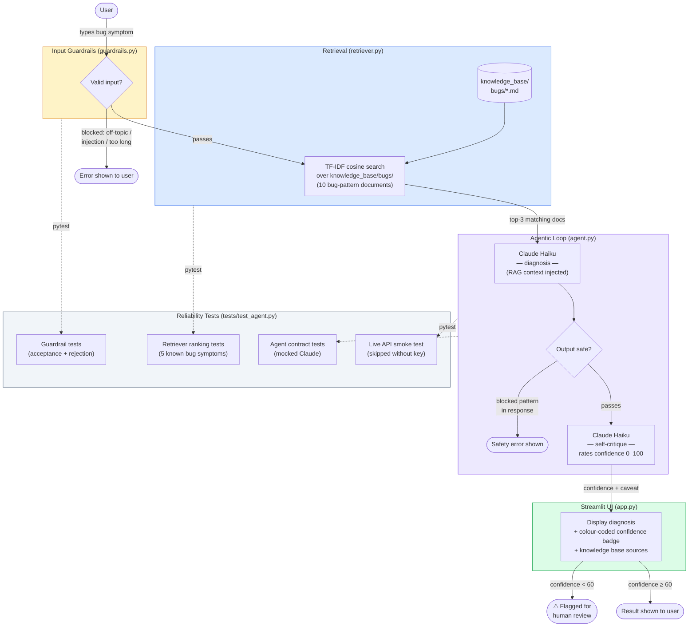

# 🎮 Game Glitch Investigator — Applied AI System

A Streamlit app with two modes:

1. **Play the Game** — a number-guessing game (Easy / Normal / Hard difficulty)
2. **AI Glitch Detective** — describe a bug symptom; the AI diagnoses it using
   Retrieval-Augmented Generation and rates its own confidence

---

## AI Features

| Feature | How it's used |
|---|---|
| **RAG** | TF-IDF retriever searches a 10-document bug-pattern knowledge base before Claude generates a diagnosis |
| **Agentic loop** | 5-step pipeline: validate input → retrieve → diagnose → validate output → self-critique |
| **Self-critique** | Claude rates its own confidence (0–100) and adds a caveat when below 60 |
| **Guardrails** | Input and output are validated for length, blocked patterns, prompt injection, and topic relevance |
| **Reliability testing** | 36 pytest tests cover guardrails, retriever ranking, agent contract, and a live API smoke test |

---

## Setup

### 1. Install dependencies

```bash
pip install -r requirements.txt
```

### 2. Set your Anthropic API key

The AI Glitch Detective tab requires a Claude API key.

```bash
export ANTHROPIC_API_KEY="sk-ant-..."
```

You can get a key at [console.anthropic.com](https://console.anthropic.com).

The game tab works without an API key. The AI tab will show an error
message if the key is missing.

### 3. Run the app

```bash
python -m streamlit run app.py
```

### 4. Run the tests

```bash
pytest
```

All 35 offline tests pass without an API key. The live smoke test
is automatically skipped when `ANTHROPIC_API_KEY` is not set.

---

## Project Structure

```
applied-ai-system-final/
├── app.py                  # Streamlit UI (game tab + AI tab)
├── agent.py                # Agentic diagnosis loop
├── retriever.py            # TF-IDF RAG retriever
├── guardrails.py           # Input/output validation and logging
├── logic_utils.py          # Core game logic
├── knowledge_base/
│   └── bugs/               # 10 bug-pattern documents (RAG corpus)
├── tests/
│   ├── test_game_logic.py  # Original game logic tests
│   └── test_agent.py       # Reliability suite for the AI pipeline
├── assets/                 # Architecture diagrams and screenshots
├── requirements.txt
└── reflection.md
```

---

## System Architecture



---

## Module 1 Bug Documentation

### Bugs Found

| # | Bug | Where |
|---|-----|--------|
| 1 | Hint messages reversed — "Go HIGHER!" when guess was too high | `logic_utils.py` → `check_guess` |
| 2 | Secret silently cast to `str` on even attempts, causing wrong lexicographic comparison | `app.py` submit block |
| 3 | Info banner always showed "1 to 100" regardless of difficulty | `app.py` `st.info` call |
| 4 | Hard mode range (1–50) was smaller than Normal (1–100); ranges swapped | `logic_utils.py` → `get_range_for_difficulty` |
| 5 | New Game button used hardcoded `random.randint(1, 100)` | `app.py` new_game block |
| 6 | All logic functions raised `NotImplementedError` | `logic_utils.py` |
| 7 | `attempts` initialized to `1` instead of `0` | `app.py` session state init |
| 8 | `update_score` added +5 on even-numbered wrong guesses | `logic_utils.py` → `update_score` |
| 9 | Difficulty change mid-game kept old secret from previous range | `app.py` — no change detection |
| 10 | Guesses outside the difficulty range were accepted | `app.py` — no range validation |

### Fixes Applied

- Swapped `check_guess` return values so `guess > secret` → "Too High"
- Removed even/odd secret-to-string conversion; always compare int to int
- Updated `st.info` to use `{low}` and `{high}` from `get_range_for_difficulty`
- Fixed difficulty ranges: Easy=1–20, Normal=1–100, Hard=1–500
- Changed hardcoded `randint(1, 100)` to `randint(low, high)` everywhere
- Implemented all four functions in `logic_utils.py`
- Changed `attempts` init from `1` to `0`
- `update_score` now always subtracts 5 for wrong guesses
- Added difficulty-change detection with full session state reset
- Added range validation before accepting a guess

## Demo


